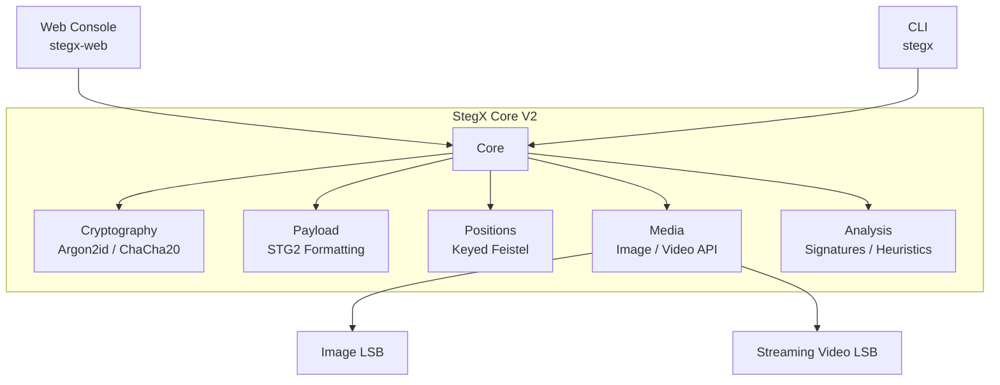
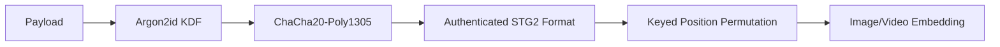

# StegX

**Secure Media Steganography Toolkit**


StegX is a modern, high-performance steganography framework designed to securely embed authenticated, encrypted payloads into image and video media. Combining strong cryptography with Least Significant Bit (LSB) embedding, StegX provides a robust platform for digital forensics research, security experimentation, and secure data handling.

StegX features both a powerful **Command Line Interface (CLI)** and a fully featured **Web Console** for graphical, interactive operation.

---

## 🔥 StegX V2 Foundation & V2.1.1 Highlights

StegX V2 introduced the authenticated STG2 protocol and hardened media-processing architecture. V2.1.1 builds on that foundation with a new Web Console, a seamless package launcher, and an improved user experience.

**StegX V2 Core Architecture:**
- **ChaCha20-Poly1305** authenticated encryption
- **Argon2id** password-based key derivation
- **Authenticated metadata** preventing payload tampering
- **Keyed Feistel permutation** with cycle walking for randomized data distribution
- **Streaming video embedding** using $\mathcal{O}(1)$ position-memory architecture
- **Explicit V1 compatibility** bridging legacy payloads
- **Detection & forensic analysis** subsystems (Signature & Heuristics)

**New in V2.1.1:**
- **Web Console** (Streamlit-based) visual GUI for interactive operations
- **Dedicated Launcher** (`stegx-web`) for clean package execution
- **Typer CLI** (`stegx`) maintained and co-existing as a primary interface

---

## 🏛️ Architecture

StegX separates its interface logic from its cryptographic core, allowing both the CLI and the Web Console to interface seamlessly with the exact same security APIs.



### V2 Processing Pipeline



---

## 🆚 Why StegX V2? (V1 vs V2)

StegX V2 introduces the `STG2` format, hardening the payload against tampering and sequential detection.

| Feature | StegX V1 (Legacy) | StegX V2.1.1 |
|---------|-------------------|--------------|
| **Payload Format** | `STEGX` (Unauthenticated) | **`STG2`** Authenticated Payload |
| **Cryptography** | Legacy crypto | **ChaCha20-Poly1305** |
| **Key Derivation** | Basic / Legacy | **Argon2id** (memory-hard) |
| **Metadata** | Unverified | **Authenticated Additional Data (AAD)** |
| **Positioning** | Sequential / Legacy Random | **Keyed Feistel with Cycle Walking** |
| **Video Processing** | High memory usage | **$\mathcal{O}(1)$ frame streaming** |
| **Interface** | CLI only | **CLI (`stegx`) + Web Console (`stegx-web`)** |

---

## 🛡️ Security Model

StegX V2 leverages state-of-the-art cryptographic primitives:
- **Argon2id**: Mitigates brute-force and GPU-based password guessing.
- **ChaCha20-Poly1305**: Provides confidentiality and integrity. The payload cannot be extracted or modified without triggering an authentication failure.
- **Fresh Salt & Nonce**: Automatically generated per payload to prevent nonce-reuse vulnerabilities.
- **Authenticated Metadata**: Filenames and payload headers are tied into the Poly1305 MAC tag.

> [!WARNING]
> **Cryptographic Security vs. Steganographic Undetectability**
> StegX guarantees cryptographic confidentiality and integrity. However, it **does not** claim steganographic undetectability. While keyed randomized positioning is intended to avoid predictable sequential placement and disperse visual artifacts, the resulting statistical noise in the LSB plane can still be identified by advanced heuristic steganalysis or machine learning detectors.

---

## 📦 Installation (Release from GitHub)

The recommended way to use StegX is to install the pre-built Python Wheel (`.whl`) provided in the [GitHub Releases](https://github.com/adicyb/StegX-v2/releases).

**1. Download the release wheel:**
Download `stegx-2.1.1-py3-none-any.whl` from the GitHub Releases page.

**2. Create a virtual environment:**
```bash
python -m venv .venv
source .venv/bin/activate  # On Windows: .venv\Scripts\activate
```

**3. Install the package:**
```bash
python -m pip install stegx-2.1.1-py3-none-any.whl
```

**4. Verify installation:**
```bash
stegx --help
```

---

## 📦 Installation (Development from Source)

If you are a developer extending StegX, install it in editable mode from the source repository.

```bash
git clone https://github.com/adicyb/StegX-v2.git
cd StegX-v2
python -m venv .venv
source .venv/bin/activate  # On Windows: .venv\Scripts\activate
python -m pip install -e .
```

*In a source checkout, you can also launch the CLI via `python -m stegx` and the Web Console via `streamlit run stegx/ui/app.py`.*

---

## 🌐 Web Console

StegX includes a professional, dark-themed cybersecurity workstation UI powered by Streamlit.

**Launch the Web Console (Installed Package):**
```bash
stegx-web
```

**Available Modules:**
- **Dashboard**: System health, architecture overview, and format compatibility.
- **Embed**: Secure media embedding workspace with capacity calculating and safe parameter input.
- **Extract**: Authenticated extraction portal supporting STG2 verification and V1 fallbacks.
- **Analyze**: Execute forensic signature detection and statistical heuristic tests.
- **Payload Builder**: Construct and visualize authenticated STG2 payloads.
- **Video Engine**: High-performance video inspection and FFV1 codec verification.
- **Settings**: Cryptographic stack information and system limits.

---

## 💻 Command Line Interface (CLI)

The Typer-based CLI remains a first-class citizen for automation and headless environments.

**View Commands:**
```bash
stegx --help
```

### Command Categories
- **Image Operations:** `hide-image`, `extract-image`
- **Video Operations:** `hide-video`, `extract-video`
- **Analysis & Forensics:** `detect`, `analyze-signature`, `analyze-heuristic`, `analyze-video-signature`, `analyze-video-heuristic`
- **Information:** `info`, `formats`, `check`, `capacity`, `video-capacity`, `video-info`, `payload-info`, `codec-test`, `video-integrity`

---

## 🚀 Quick Start (CLI)

### Image Embedding (V2)
It is highly recommended to use the interactive password prompt (`-p`) rather than exposing secrets in your shell history.
```bash
stegx hide-image carrier.png secret.txt --output-path stego.png \
  --position-key "my_randomization_key" -p
# (You will be prompted securely for the master password)
```

### Video Embedding (V2)
Video requires an uncompressed or lossless codec (e.g., FFV1 via AVI) to preserve the LSB data.
```bash
stegx hide-video carrier.avi secret.zip --output-path stego.avi \
  --position-key "my_randomization_key" -p
```

### V1 Compatibility Extraction
V1 handling is strict, explicit, and isolated. Old `STEGX` payloads are not automatically upgraded.
```bash
stegx extract-image stego_v1.png --output-directory extracted_dir/ --v1 -p
```

---

## 📼 Video Architecture

StegX V2 processes video frame-by-frame using an **$\mathcal{O}(1)$ position-memory architecture**. Whether the video is 5 MB or 5 GB, StegX streams the frames dynamically, enabling massive payload support without crashing system RAM.

*Note: Video embedding explicitly relies on the FFV1 codec. Highly compressed codecs like H.264/H.265 destructively alter pixels, destroying LSB payloads.*

---

## 📂 V2 Payload Format (STG2)

StegX wraps user data into the `STG2` binary protocol before embedding. Metadata and constraints are strictly enforced before unlocking ciphertext.

```text
[ 4B ] MAGIC: STG2
[ 1B ] VERSION: 0x02
[ 1B ] FLAGS (e.g., Encrypted)
[ 2B ] FILENAME_LEN
[ 8B ] PAYLOAD_LEN
[ VAR ] FILENAME
[ 16B ] SALT (Argon2id)
[ 12B ] NONCE (ChaCha20)
[ VAR ] CIPHERTEXT
[ 16B ] MAC TAG (Poly1305)
```

---

## 🧪 Testing

The codebase is heavily tested to ensure cryptographic integrity, format boundaries, and interface reliability.

Current validation: **97 tests passed** covering core cryptography, memory exhaustion protections, path traversal defenses, V1 backward compatibility, and Web Console integrity.

```bash
python -m pytest -q
```

---

## 🌲 Project Structure

```text
stegx/
├── analysis/       # Forensics, heuristics, and signature detection
├── cli.py          # Typer/Rich command line interface
├── core/           # Cryptography, STG2 payload processing, positioning
├── image/          # Image embedding and extraction engines
├── ui/             # Streamlit Web Console, launcher, and page routing
├── utils/          # Shared utility functions
└── video/          # Streaming video processing
```

---

## ⚠️ Limitations

- **FFV1 Codec Dependency:** Videos must be exported using lossless FFV1. Standard formats like MP4/H.264 compression will strip and destroy the payload.
- **Steganalysis Visibility:** The statistical anomaly introduced by randomized bit-flipping is measurable via chi-square and entropy analysis.
- **Payload Capacity:** Capacity depends on carrier dimensions, available channels, and protocol overhead. V2 explicitly enforces a strict 1 GiB payload limit. StegX calculates boundaries securely and rejects payloads that exceed physical limits.

---

## 🗺️ Roadmap

- Batch processing support for massive collections of media.
- Automated forensic report generation for extracted media metrics.

---

## ⚖️ License

There is currently no formal OSI-approved license file in this repository. The author has explicitly designated the codebase for educational and research purposes. See the disclaimer below.

---

<div align="center">

<sub>Built for cybersecurity education, digital forensics research, and steganography experimentation.</sub>
<br/>
<sub><strong>Not to be used for concealing malicious content or evading legitimate security controls.</strong></sub>

<br/><br/>

<sub><strong>Aditya Khandelwal</strong> — Cybersecurity · Digital Forensics · Security Research</sub>
<br/>
<sub>Educational / research use · ⭐ star the repo if StegX was useful to you</sub>

</div>